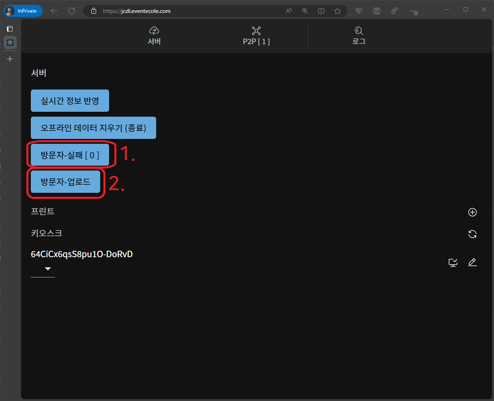
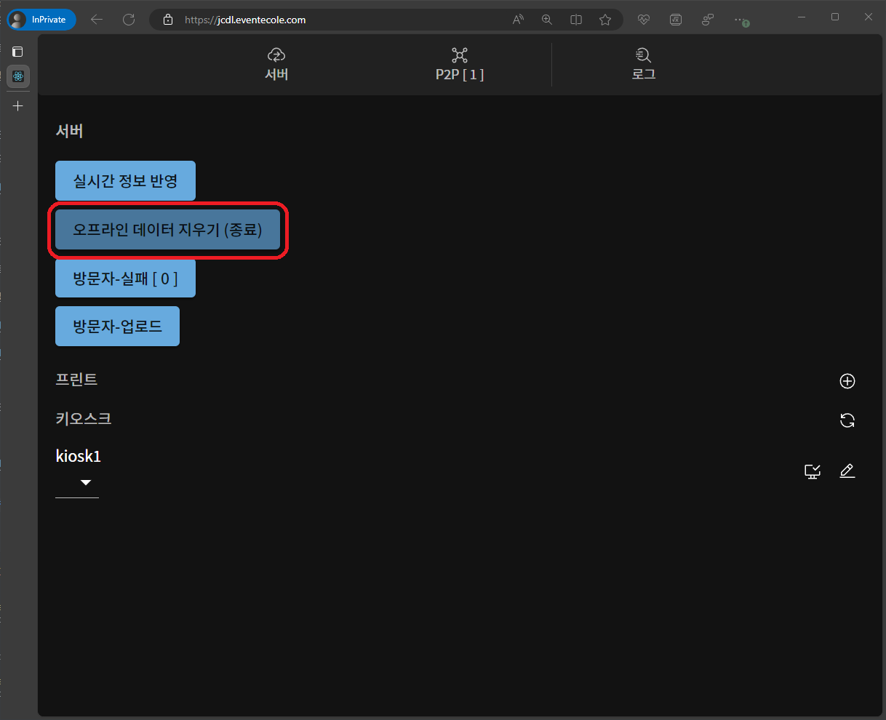

# 종료하기 \[매니저\]

## 1. 데이터 마감

**`방문자-실패[0]`** 버튼을 클릭하여 매니저의 데이터를 삭제 하기전 서버에 업로드 되지 않은 방문기록이 있는지 확인합니다.

만약 **`실패`** 라는 옆 숫자가 **`0보다 크다면`** 그 아래에 있는 **방문자-업로드** 버튼을 클릭합니다.

## 2. 데이터 삭제

:::warning
본 항목은 기기에 저장된 모든 데이터를 영구히 삭제합니다.

본 항목을 수행 하기전 반드시 **[`키오스크 - 데이터마감`](./ended-kiosk)**과 **[`매니저 - 데이터 마감`](./ended-manager#1-데이터-마감)**을 수행해주십시오.
:::

모든 행사가 종료 되면 매니저의 데이터를 지워야합니다.

**서버 > `오프라인 데이터 지우기 (종료)`** 버튼을 클릭힙니다.

로그인 페이지로 넘어가면 성공적으로 데이터가 지워졌습니다.

