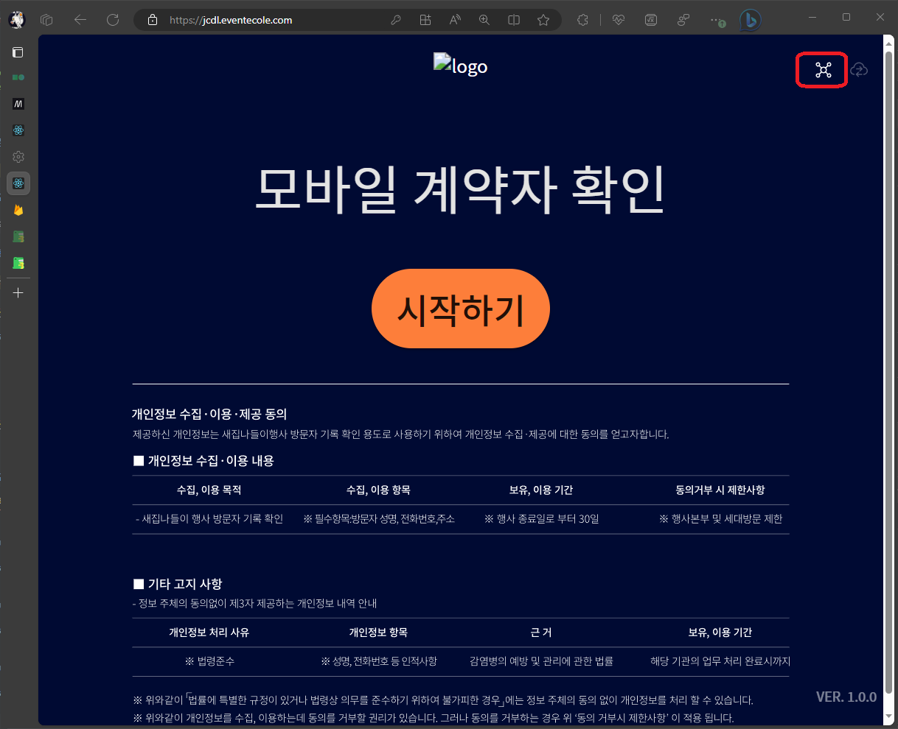
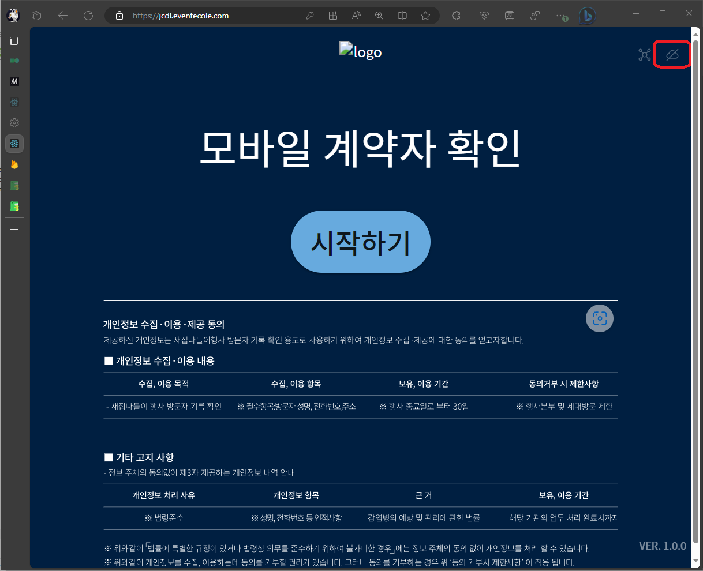

# 운영 및 오류 조치 \[키오스크\]

## 매니저와 연결이 끊겼을 경우

### 오류 원인

- 공유기 연결(와이파이 또는 핫스팟)이 불안정한 경우

### 확인 방법

매니저와의 연결이 끊겼을 경우 페이지 상단 우측 **`메쉬`**아이콘이 활성화 됩니다.

### 해결 방법

1. 페이지 상단 우측 **`메쉬`**아이콘을 클릭하십시오.
2. 페이지 상단 우측 **`메쉬`**아이콘이 음영처리 된 후 `키오스크 - 종료하기`의 **[`3. 데이터 마감`](./ended-kiosk#1-데이터-마감)**을 수행해 주십시오.

## 프린트가 안되는 경우

### 오류 원인

- 매니저와 연결이 끊겼을 경우
- 키오스크와 프린터의 매칭이 안된 경우

### 확인 방법

1. 매니저와의 연결이 끊겼을 경우 페이지 상단 우측 **`메쉬`**아이콘이 활성화 됩니다.
2. 매니저에서 프린트 목록에서 제거가 되어있습니다.
3. 매니저에서 키오스크 목록에서 프린터 설정이 빈칸으로 되어있습니다.

### 해결 방법

1번의 경우 `키오스크 - 운영 및 오류 조치`에서 **[`매니저와 연결이 끊겼을 경우`](./operation-kiosk#매니저와-연결이-끊겼을-경우)**을 참고 하십시오.

2, 3번의 경우` 매니저 - 운영 및 오류 조치`에서 **[`프린트가 안되는 경우`](./operation-manager#프린트가-안되는-경우)**을 참고 하십시오.

## 문자 발송 버튼이 안보이는 경우

### 오류 원인

- 인터넷 연결(와이파이 또는 핫스팟)이 불안정한 경우
- 매니저와 연결이 끊겼을 경우
- 관리자가 비활성화한 경우

### 확인 방법

1. 인터넷 연결이 끊겼을 경우 페이지 상단 우측 **`클라우드`**아이콘이 사진과 같이 끊긴 모양으로 변경 됩니다.
2. 매니저와의 연결이 끊겼을 경우 페이지 상단 우측 **`메쉬`**아이콘이 활성화 됩니다.

### 해결 방법

1번의 경우` 매니저 - 운영 및 오류 조치`에서 **[`인터넷 연결이 끊겼을 경우`](./operation-manager#인터넷-연결이-끊겼을-경우)**을 참고 하십시오.

2번의 경우 `키오스크 - 운영 및 오류 조치`에서 **[`매니저와 연결이 끊겼을 경우`](./operation-kiosk#매니저와-연결이-끊겼을-경우)**을 참고 하십시오.

위 경우에 해당하지 않는 경우 관리자에게 연락하십시오.

## 방문자 - 실패의 값이 0보다 큰 경우

### 오류 원인

- 매니저와 연결이 끊겼을 경우

### 확인 방법

1. 매니저와의 연결이 끊겼을 경우 페이지 상단 우측 **`메쉬`**아이콘이 `활성화` 되어있습니다.
2. 매니저와의 연결이 끊겼을 경우 페이지 상단 우측 **`메쉬`**아이콘이 `비활성화` 되어있습니다.

### 해결 방법

1번의 경우 `키오스크 - 운영 및 오류 조치`에서 **[`매니저와 연결이 끊겼을 경우`](./operation-kiosk#매니저와-연결이-끊겼을-경우)**을 참고 하십시오.

2번의 경우 키오스크의 프로그램을 재실행 및 재연결을 시도 하십시오.

위 방법을 통해 매니저와 연결에 성공했다면 자동으로 업로드가 이루어 집니다.

:::caution
연결 완료 후 반드시 `키오스크 - 종료하기`의 **[`3. 데이터 마감`](./ended-kiosk#1-데이터-마감)**을 수행해주십시오.
값은 항상 `0` 이여야합니다.
:::

위 경우에 해당하지 않는 경우 관리자에게 연락하십시오.
