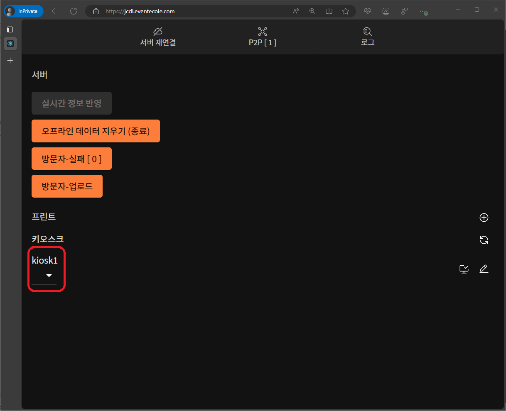
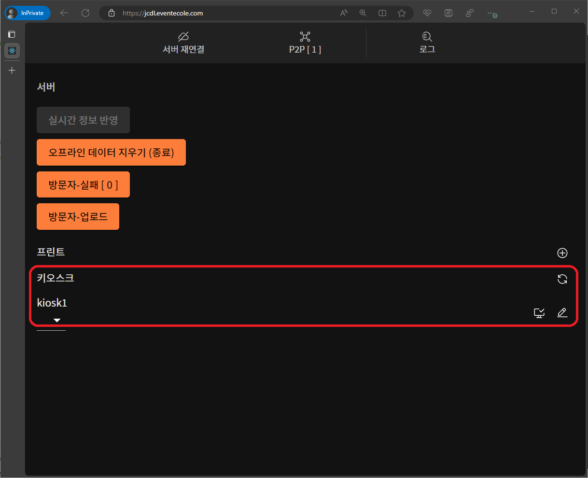

# 운영 및 오류 조치 \[매니저\]

## 인터넷 연결이 끊겼을 경우

### 오류 원인

- 인터넷 연결(와이파이 또는 핫스팟)이 불안정한 경우
- 서버가 불안정한 경우

### 확인 방법

매니저의 인터넷 연결이 끊겼을 경우 페이지 상단 **`서버 재연결`**아이콘 변경되고 **`실시간 정보 반영`** 버튼이 비활성화 됩니다.

### 해결 방법

1. 상단 **`서버 재연결`** 버튼을 클릭하십시오.
2. 하단 버튼 중 **`실시간 정보 반영`** 버튼을 클릭하십시오.
3. 하단 버튼 중 **`방문자-업로드`** 버튼을 클릭하십시오.

## 프린트가 안되는 경우

### 오류 원인

- USB가 분리된 경우
- 프린터가 꺼진 경우
- 키오스크와 프린터의 매칭이 안된 경우
- 알 수 없는 오류

### 확인 방법

1. 프린트 목록에서 제거가 되어있습니다.
2. 키오스크 목록에서 프린터 설정이 빈칸으로 되어있습니다.

### 해결 방법

1번의 경우 `매니저 - 시작하기`에서 **[`2. 프린터 연결`](./#2-프린터-연결)**을 참고 하십시오.

2번의 경우` 매니저 - 시작하기`에서 **[`6. 프린터 매칭`](./#6-프린터-매칭)**을 참고 하십시오.

## 키오스크 연결이 끊긴 경우

### 오류 원인

- 인터넷 연결(와이파이 또는 핫스팟)이 불안정한 경우
- 키오스크(태블릿)이 꺼진 경우
- 알 수 없는 오류

### 확인 방법

키오스크 목록에서 제거가 되어있습니다.

### 해결 방법

`매니저 - 시작하기`에서 **[`4. 키오스크 연결`](./#4-키오스크-연결)**을 참고 하십시오.