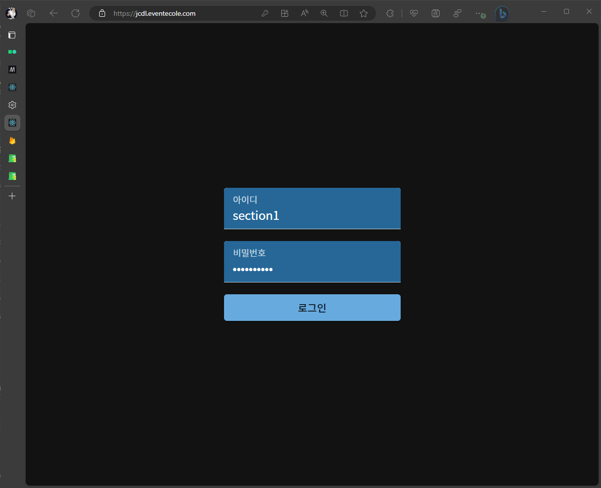
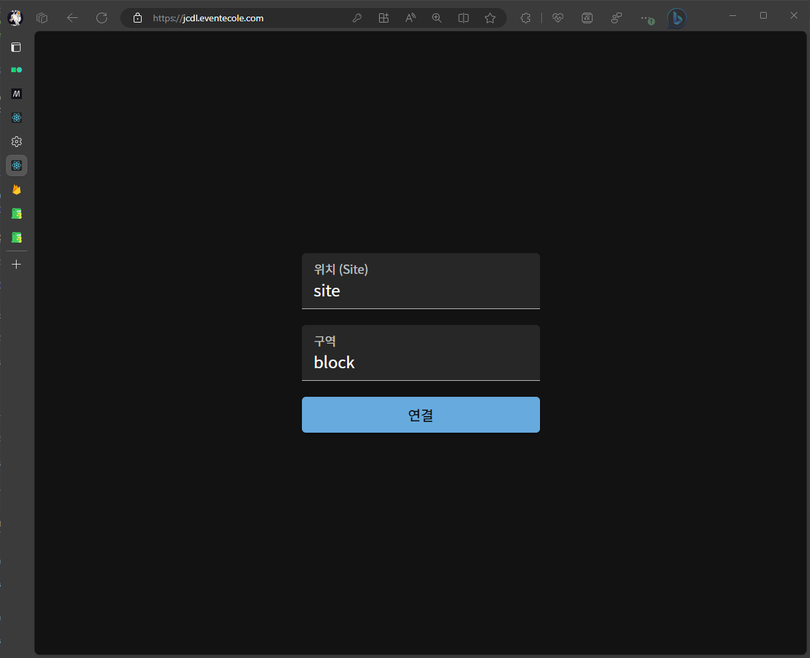

# 시작하기 \[키오스크\]

:::note
키오스크 설정을 하기 전 **(주)에꼴**을 통해 사전 입력 정보를 받아야 합니다.
:::

:::caution
해당 프로그램은 `크롬` 또는 `엣지` 브라우저에서 정상작동 합니다.
:::

:::warning
본 설정을 하기 전 반드시 **[`매니저`](./)**설정을 마친 후 진행하시기 바랍니다.  
만약 먼저 진행을 하였다면 **`키오스크 - 종료하기`에서 [`2. 데이터 삭제`](./ended-kiosk#2-데이터-삭제)**진행 후 다시 설정하시기 바랍니다. 
:::

## 1. 사전 설정

### 1. 로그인

전달 받은 **주소** `( [행사명].eventecole.com의 형태 )`에 접속합니다. 
해당 페이지에서 **`아이디`**와 **`비밀번호`**를 입력합니다.

### 2. 역할 설정

해당 페이지에서 **`키오스크`**를 클릭합니다.

### 3. 구역 설정

전달 받은 **`위치`**와 **`구역`**을 입력합니다.

### 4. 확인

아래의 이미지와 같이 화면에 표시되는지 확인합니다.

## 2. 키오스크 설정

키오스크는 별도의 설정이 필요 하지않습니다.
