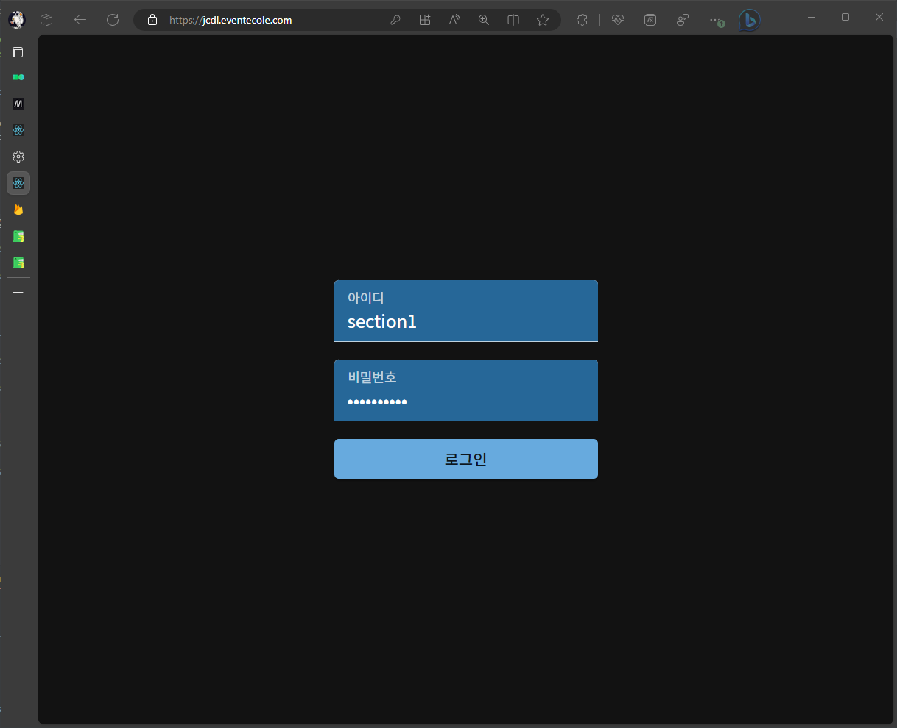
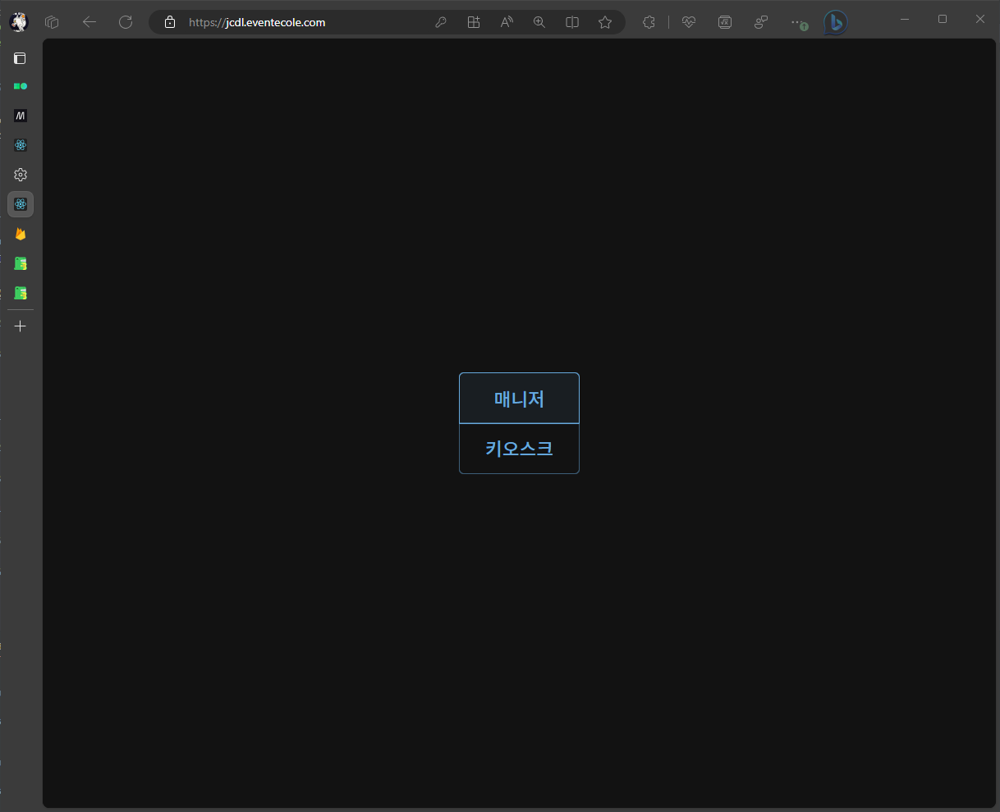
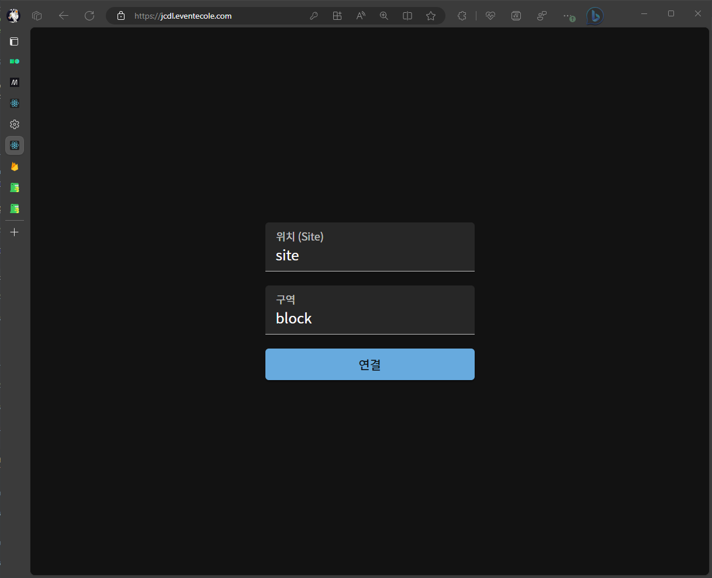
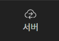
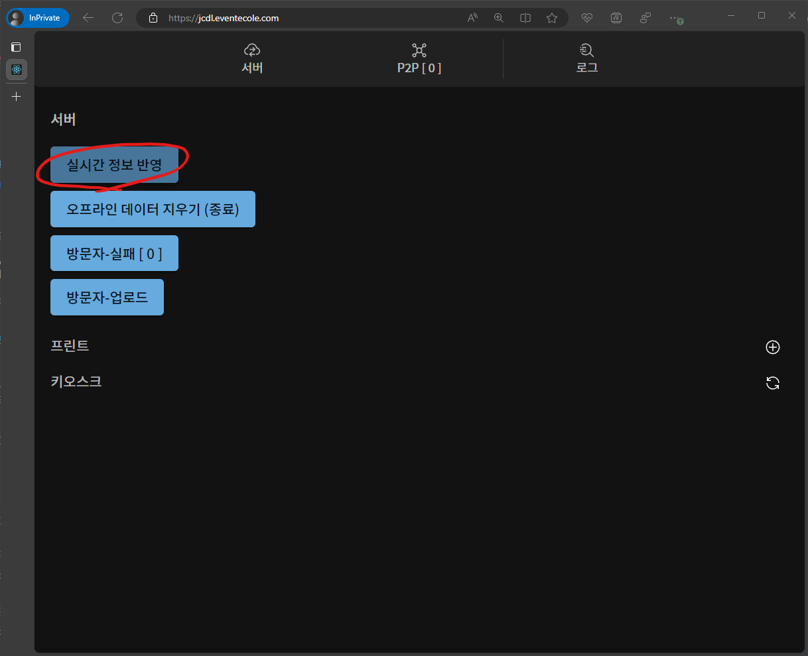
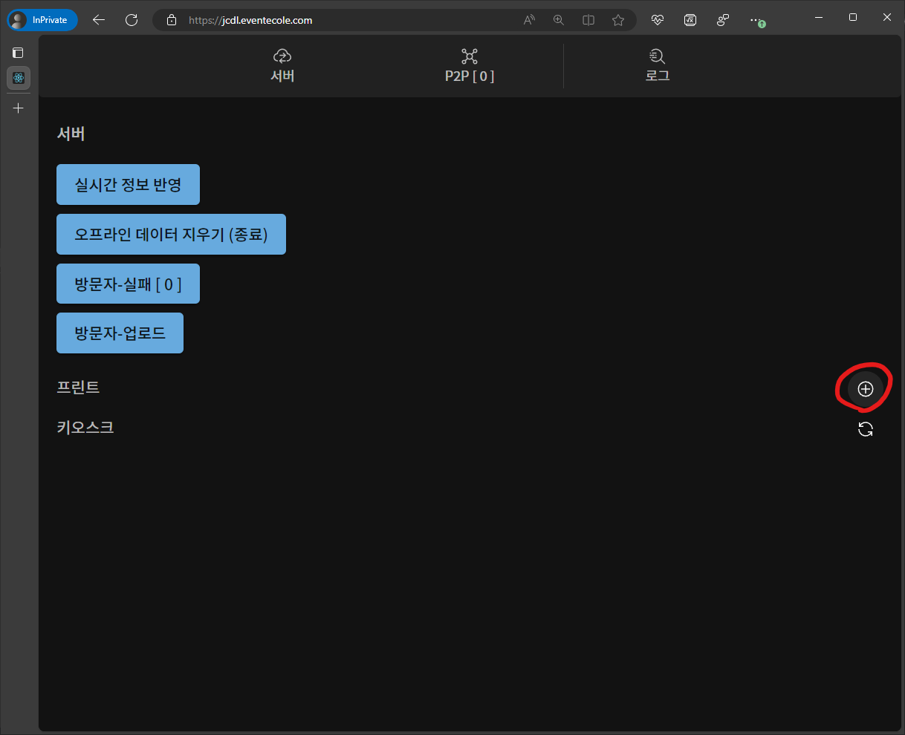
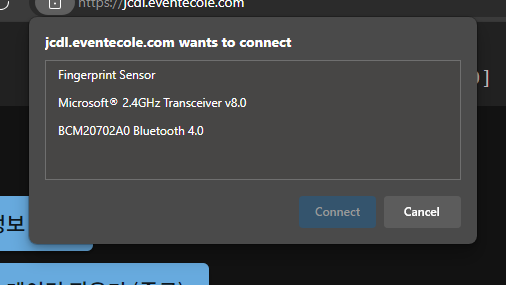
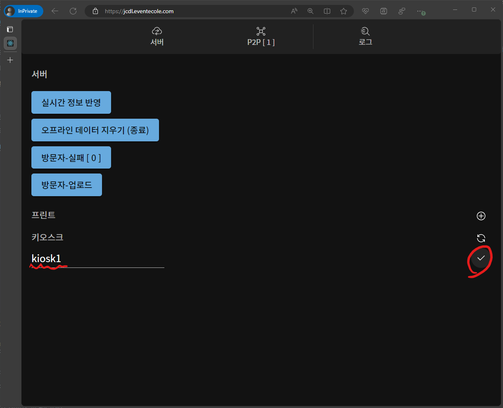
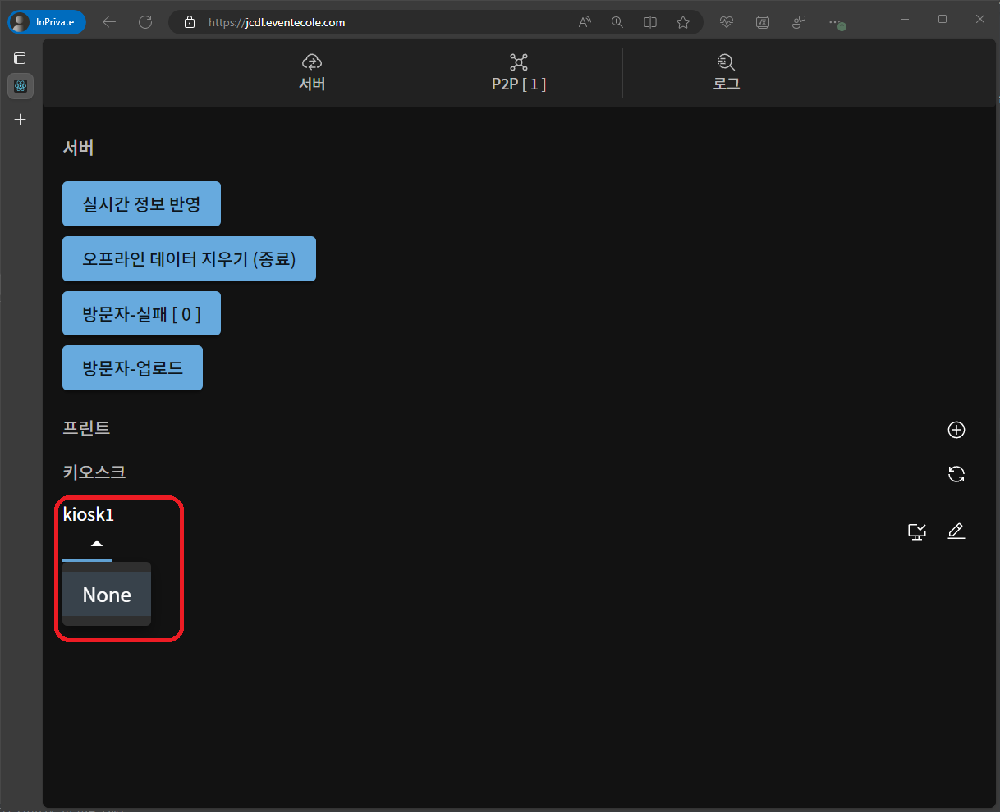

# 시작하기 \[매니저\]

:::note
키오스크 설정을 하기 전 **(주)에꼴**을 통해 사전 입력 정보를 받아야 합니다.
:::

:::caution
해당 프로그램은 `크롬` 또는 `엣지` 브라우저에서 정상작동 합니다.
:::

## 1. 사전 설정

### 1. 로그인

전달 받은 **주소** `( [행사명].eventecole.com의 형태 )`에 접속합니다. 
해당 페이지에서 **`아이디`**와 **`비밀번호`**를 입력합니다.

:::info
한번 로그인된 기기는 해당 순서를 건너뜁니다.
:::

### 2. 역할 설정

해당 페이지에서 **`매니저`**를 클릭합니다.

### 3. 구역 설정

전달 받은 **`위치`**와 **`구역`**을 입력합니다.

### 4. 확인

아래의 이미지와 같이 화면에 표시되는지 확인합니다.

## 2. 매니저 설정

### 1. 서버와 연결

페이지의 상단 버튼 중 **서버 > `실시간 정보 반영`** 버튼을 클릭합니다.

:::info
해당 버튼이 회색으로 음영 처리 되어있을 경우 서버와의 연결이 이루어지지 않은 상태입니다. 

- 인터넷 연결을 확인해주십시오.
- 상단 메뉴에서 **`서버`**버튼을 클릭하여 재연결 해주십시오.

  

:::

:::caution
서버와의 연결이 끊길 경우 서버와 연결 후 항상 클릭 해주셔야 합니다.
:::

### 2. 프린터 연결

아래 사진에서 표시된 버튼 **`( 프린터 우측 "+" 버튼 )`** 클릭합니다.

브라우저 상단에서 연결할 프린터를 연결합니다.

위 과정을 프린터 수 만큼 반복합니다.

### 3. (옵션) 프린터 이름 설정

:::info
**`연필`**모양의 버튼의 왼쪽 **`프린터`**모양의 버튼을 클릭하여 어떤 프린터인지 쉽게 알 수 있습니다. 
:::

프린터의 연결이 성공적으로 이루어졌다면 편의를 위해 이름을 설정할 수 있습니다.

무작위로 지어진 이름 우측 **`연필`**모양의 버튼을 클릭합니다.

이름(별칭)을 입력하고 오른쪽 **`체크`**버튼을 클릭합니다.

### 4. 키오스크 연결

**[`키오스크 - 시작하기`](started-client.md)**를 통해 키오스크 연결을 진행합니다.

성공적으로 연결되었다면 아래의 사진과 같이 표현됩니다.

### 5. (옵션) 키오스트 이름 설정

:::info
**`연필`**모양의 버튼의 왼쪽 **`화면`**모양의 버튼을 클릭하여 어떤 키오스크인지 쉽게 알 수 있습니다. 
:::

키오스크(태블릿)의 연결이 성공적으로 이루어졌다면 편의를 위해 이름을 설정할 수 있습니다.

무작위로 지어진 이름 우측 **`연필`**모양의 버튼을 클릭합니다.

이름(별칭)을 입력하고 오른쪽 **`체크`**버튼을 클릭합니다.

### 6. 프린터 매칭

키오스크(태블릿)와 프린트를 서로 매칭하여 인쇄가 올바른 프린터에서 되도록 설정해야합니다.

아래의 사진처럼 키오스크 아래 **`드롭다운 메뉴`** 클릭 후 프린터를 선택해주시면 됩니다.

